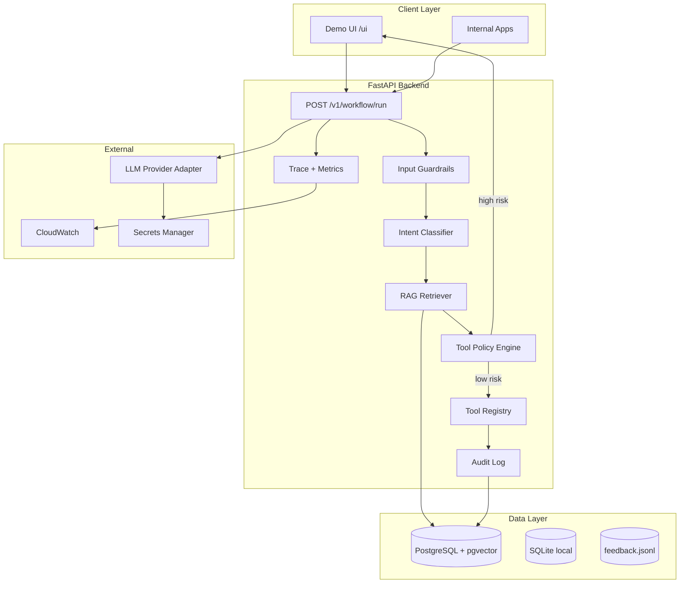

# System Design Case Study — Internal Banking Knowledge Assistant

**Case:** Kurum çalışanları için `Internal Banking Knowledge Assistant + Actionable Support Agent`

Bu doküman, projedeki mevcut modülleri tek bir expert-seviye sistem tasarım cevabında birleştirir.

## 1. Problem ve kullanıcı

**Problem:** Çalışanlar policy/procedure sorularında manuel arama yapıyor; yüksek riskli işlemlerde onay süreci dağınık.

**Kullanıcılar:**
- Front-office / call center çalışanları (policy lookup)
- Operations (transfer, limit, onay işlemleri)
- Compliance / audit (izlenebilirlik)

**Başarı kriteri:** Kaynaklı, hızlı cevap + yüksek riskte insan onayı + tam audit trail.

## 2. Uçtan uca mimari



**Kod eşlemesi:**

| Bileşen | Modül |
|---------|-------|
| Workflow orchestration | `src/agents/workflow.py` |
| Intent classification | `src/agents/classifier.py` |
| RAG retrieval | `src/rag/retriever.py` |
| Tool policy | `src/agents/policies.py` |
| Input guardrails | `src/security/input_guardrails.py` |
| Audit / compliance | `src/security/audit.py` |
| Observability | `src/observability/traces.py`, `metrics.py` |
| Data persistence | `src/data/` |
| API surface | `src/api/routers/workflow.py` |
| Demo UI | `frontend/` |

## 3. Request akışı (canlı kod)

Tek entry point: `POST /v1/workflow/run`

```text
1. Input guardrail (prompt injection, exfiltration)
2. classify_intent → structured JSON (IntentClassification)
3. retrieve_context → top-k policy docs + citations
4. decide_action → tool routing (knowledge_search / transfer_money / none)
5. request_human_approval → policy engine + approval_id
6. [pause if awaiting_approval]
7. execute_tool → idempotent, role-checked
8. final_answer → grounded response + sources
9. audit_log → compliance event
10. trace_summary → observability timeline
```

**Resume:** Aynı endpoint, `run_id` + `approval_granted: true` ile checkpoint'ten devam.

**Demo senaryoları:** `python -m src.case_study.run_demo`

## 4. Data katmanı

| Veri | Amaç | MVP | Production |
|------|------|-----|------------|
| Policy dokümanları | RAG corpus | Mock retriever | pgvector + ingestion pipeline |
| Conversations / messages | Context | SQLite | PostgreSQL |
| Tool executions | Idempotency + replay | SQLite | PostgreSQL |
| Audit events | Compliance | JSONL + DB | PostgreSQL, immutable |
| Feedback | Eval loop | `data/feedback.jsonl` | S3 + batch eval job |

**Ingestion pipeline (production):**
1. Doküman kaynağı (SharePoint, Confluence, PDF)
2. Chunk + metadata (department, classification level, version)
3. Embedding → pgvector
4. Access control metadata (RBAC filter at retrieval time)

## 5. Retrieval stratejisi

**MVP:** Mock retriever — deterministik test.

**Production:**
- Hybrid search: dense (pgvector) + sparse (BM25)
- Metadata filter: tenant, role, document classification
- Reranking (cross-encoder veya LLM rerank)
- Citations zorunlu — cevapta `Sources: doc_id` (mevcut workflow pattern)

**Trade-off:** Hybrid daha iyi recall; latency + infra maliyeti artar. MVP'de dense-only yeterli.

## 6. Agent ve tool execution

**Prensip:** Deterministic routing + guarded tool execution. LLM sadece classify ve final answer üretiminde.

```text
Intent → Router (kod) → Policy check (kod) → Tool (idempotent)
```

**Human-in-the-loop:** `transfer_money` gibi high-risk tool'lar `REQUIRE_APPROVAL`. UI modal + `approval_id` audit'e yazılır.

**Idempotency:** `idempotency_key` ile resume'da tool tekrar çalıştırılmaz (`tool_executed` flag).

## 7. Security

| Katman | Uygulama |
|--------|----------|
| Input | `validate_user_input` — injection, exfiltration |
| Tool args | `validate_tool_arguments` |
| RBAC | `UserRole` + `can_execute_tool` matrix |
| PII | `mask_pii` audit/feedback'te |
| Tenant isolation | `tenant_id` data layer + SQL guardrails |
| Approval | High-risk → pause + audit id |

**Kırmızı bayrak:** "Prompt + vector DB yeterli" — access control ve audit olmadan production'a çıkılmaz.

## 8. Evaluation pipeline

```text
Golden dataset → run_evals → regression gate (CI)
User feedback (trace_id) → feedback.jsonl → human review → golden dataset
```

| Eval türü | Dosya / endpoint |
|-----------|------------------|
| Classification | `classification_golden_dataset.jsonl` |
| RAG | `GET /v1/rag/eval` |
| Analyst SQL | `GET /v1/analyst/eval` |
| Full regression | `python -m src.evals.run_evals` |

**Production gate:** Deploy öncesi eval regression geçmeli; accuracy düşüşü rollback tetikler.

## 9. Observability

| Metrik | Kaynak |
|--------|--------|
| Latency per step | `trace_summary.timeline` |
| LLM cost / tokens | `metrics.record_llm_call` |
| HTTP latency | middleware |
| Workflow status | `metrics.record_workflow_run` |
| Error taxonomy | trace status + audit `workflow_failed` |

**Debug:** `GET /v1/observability/traces/{trace_id}`

**Dashboard (production):** CloudWatch + custom Grafana (p95 latency, approval rate, block rate, cost/interaction).

## 10. Deployment

Local (birincil): `uvicorn` + SQLite + mock LLM.

Staging/Prod: `docs/aws_architecture.md` — ECS Fargate, RDS PostgreSQL, ALB, Secrets Manager, CloudWatch.

CI/CD: `.github/workflows/ci.yml` (pytest + docker smoke), `deploy.yml` (compose / AWS).

## 11. MVP vs sonraki fazlar

### MVP (ilk 6–8 hafta)

- [x] Workflow orchestration (classify → RAG → policy → tool)
- [x] Input guardrails + RBAC policy matrix
- [x] Human approval checkpoint
- [x] Audit log + trace
- [x] Golden eval + CI
- [x] Demo UI
- [ ] Gerçek doküman ingestion (1 departman pilot)
- [ ] PostgreSQL + pgvector (staging)

### Faz 2

- Hybrid retrieval + reranking
- Multi-agent delegation (complaint → ticket agent)
- Production observability dashboard
- Feedback → otomatik eval dataset pipeline

### Faz 3

- Multi-tenant hardening
- Model A/B testing
- Cost optimization (caching, smaller models for classify)

## 12. Kritik failure mode'lar

| Failure | Etki | Mitigation |
|---------|------|------------|
| Hallucinated policy | Yanlış prosedür | RAG citations zorunlu, eval regression |
| Prompt injection | Policy bypass | Input guardrails, backend-only system prompt |
| Unauthorized transfer | Finansal kayıp | RBAC + approval + idempotency |
| LLM timeout | Kötü UX | Retry + fallback model + timeout error UX |
| Stale documents | Eski policy | Ingestion versioning + TTL |
| Eval drift | Sessiz kalite düşüşü | CI regression gate |
| PII leak in logs | Compliance ihlali | mask_pii + log review |

## 13. Production readiness checklist

Detay: `docs/production_readiness_checklist.md`

Özet:
- Security review (guardrails, RBAC, PII)
- Eval regression green
- Healthcheck + metrics
- Secrets rotation plan
- Rollback procedure documented
- Incident runbook

## 14. Business impact ölçümü

| Metrik | Tanım | Hedef (örnek) |
|--------|-------|---------------|
| Resolution time | Soru → cevap süresi | −40% vs manuel arama |
| Deflection rate | Agent çözdü, escalasyon yok | >60% knowledge soruları |
| Accuracy | Golden eval pass rate | >90% |
| Adoption | Aktif kullanıcı / hafta | Pilot departmanda >70% |
| Cost per interaction | LLM token + infra | < $0.05 / interaction |
| Approval SLA | Onay bekleme süresi | < 5 dk p95 |

**Ölçüm kaynakları:** trace latency, feedback.jsonl, audit events, eval runner.

## 15. Mülakat cevap iskeleti (5 soru)

1. **Uçtan uca kurulum:** Problem → data ingestion → FastAPI workflow → RAG + policy → approval → audit → eval → AWS deploy.
2. **Failure modes:** Hallucination, injection, unauthorized action, timeout, stale data — yukarıdaki tablo.
3. **MVP scope:** Knowledge lookup + guarded transfer + audit + eval. Sonraya: hybrid search, multi-agent.
4. **Production checklist:** Security, eval gate, observability, secrets, rollback — `production_readiness_checklist.md`.
5. **Business impact:** Resolution time, deflection, accuracy, adoption, cost/interaction — trace + feedback ile ölç.

## 16. Güçlü sinyaller (mülakatta vurgula)

- MVP scope net; "her şeyi birden" değil
- Security-first: frontend untrusted, backend policy zorunlu
- Traceability: her adım audit + trace_id
- Cost/latency trade-off: mock → OpenAI, SQLite → RDS bilinçli geçiş
- Rollback: image tag downgrade + eval regression gate

## 17. Intent taxonomy (bank chatbot)

| Intent | Örnek | Route |
|--------|-------|-------|
| `general_faq` | "EFT saatleri nedir?" | RAG pipeline |
| `product_info` | "İhtiyaç kredisi nedir?" | RAG pipeline |
| `balance_query` | "Bakiyem ne kadar?" | Secure API tool (auth required) |
| `transaction_history` | "Son 5 işlemimi göster" | Secure API tool |
| `money_transfer` | "Ali'ye 5000 TL gönder" | MFA + explicit confirmation |
| `fraud_report` | "İzinsiz para çekildi" | Fraud workflow |
| `financial_advice` | "Bu hisseyi alayım mı?" | Refusal / escalation |

Referans implementasyon: `src/case_study/bank_chatbot.py`

## 18. Observability log şeması (referans)

```sql
CREATE TABLE bank_chatbot_logs (
    id BIGSERIAL PRIMARY KEY,
    session_id TEXT,
    user_id_hash TEXT,
    query TEXT,
    intent TEXT,
    retrieved_doc_ids JSONB,
    retrieval_scores JSONB,
    tool_calls JSONB,
    answer TEXT,
    groundedness_score FLOAT,
    correctness_score FLOAT,
    safety_score FLOAT,
    latency_ms INT,
    escalated BOOLEAN,
    error_type TEXT,
    created_at TIMESTAMP DEFAULT CURRENT_TIMESTAMP
);
```

Judge eval: `GET /v1/evals/judge` — retrieval eval: `GET /v1/rag/eval`
